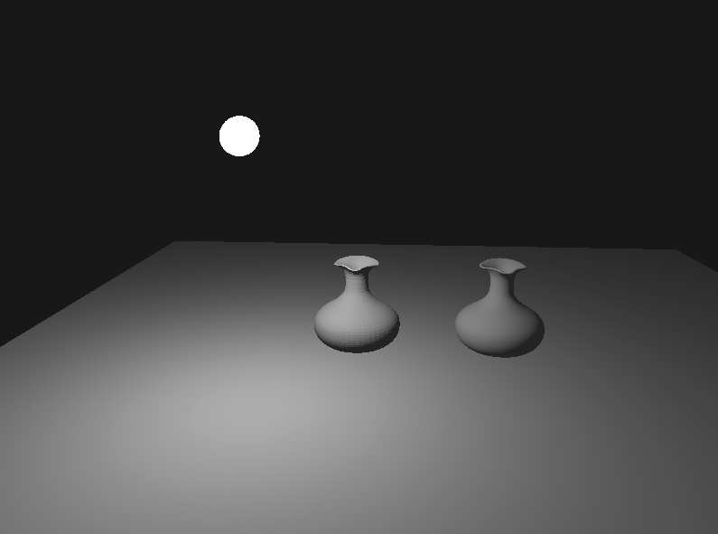
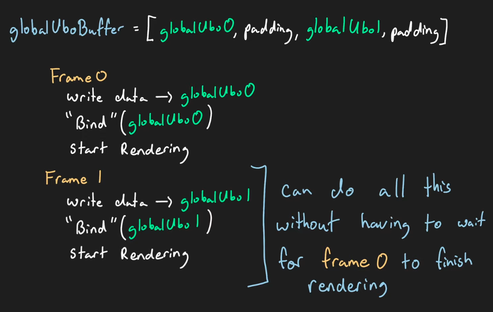

# Vulkan API Study Note

To better understand how do low-level programming with graphic APIs, I decided to follow the tutorial [Vulkan Game Engine Tutorials](https://www.youtube.com/watch?v=Y9U9IE0gVHA&list=PL8327DO66nu9qYVKLDmdLW_84-yE4auCR) to build a renderer step by step. 

I hope to document the techniques or skills which I feel important through the learning experience. 

## Results

I forget to record the generated results until Descriptor Set section T_T. 

The result for Descriptor Set (2022/12/06):


The result for Point Light (2022/12/08):


The result for Fragment Lighting (2022/12/28)


The result for Fragment Lighting (2022/12/31)



## Pipeline Overview

The simplified Vulkan pipeline:


The namespace in the code lve means little Vulkan engine. 

## Device Setup

In `lve_pipeline.hpp`, we define the pipeline and its functions. 

Overview for the `LveDevice` class
```C++
LveDevice::LveDevice(LveWindow &window) : window{window} { // Initialize hardware for vulkan 
  createInstance();
  setupDebugMessenger(); 
  // Since Vulkan does little error checking, this validation layer is importance 
  // for developing, this could be delete when releasing for efficiency
  createSurface();
  pickPhysicalDevice(); // Graphic device in the device for Vulkan
  createLogicalDevice();
  createCommandPool(); // Help with command buffer
}
```

## Fixed Function Pipeline Stages

The pipeline is configured with the class `PipelineConfigInfo`. Within the class, we set:
- input assembly configuration 
- topology (triangle lists for example)
- view port and scissor
- rasterization stage
- multisample anti-aliasing
- color blend
- depth buffer

## Swap Chain

Swap chain is a series of frame buffers that are used to be displayed on window. 


Vertical Synchronization (VSync), helps create stability by synchronizing the image frame rate of your game or application with your display monitor refresh rate. If it's not synchronized, it can cause screen tearing, an effect that causes the image to look glitched or duplicated horizontally across the screen.

Double Buffering


Triple Buffering: 

Triple buffering is automatically for some graphic APIs (not for Vulkan). 

Coming to implementation:
1. We will have multiple frame buffers (2 or 3).
2. We can use `swapChain.acquireNextImage()` to get the next index of our frame buffers.

Vulkan present model in function `VkPresentModeKHR LveSwapChain::chooseSwapPresentMode`:


In `LveSwapChain::createRenderPass()`, for now, a renderpass describes the structure and format of the frame buffer objects and their attachments.

## Command Buffer


Command Buffer Life Cycle


*At most 2 frames can be submitted for rendering at once.*

In Vulkan API, the primary command buffer can be directly submitted, but the secondary command buffer can only be called by other command buffer (cannot be directly submitted).

## Vertex Buffer


Vertex Attribute Description

- binding: binding = 0
- location: location = 1
- offset: offset = 8 bytes
- format: format = VK_FORMAT_R32G32B32_SLFOAT

For example: `layout(location = 1) in vec3 color;`

## Fragment Interpolation


SIMD Model (Single instruction - multiple data) is one of the main reasons why GPU process large amount of data faster than CPU, by trading the flexibility.

## Swap Chian Recreation & Dynamic Viewport

In order to resize the window, we need to recreate the swap chain every time the window size is changed. 
*Notice that before this procedural, you cannot resize the window as well as move the window to another monitor screen (if you have one), which would lead to crash.*

1. Now it is able to listen to size changes on the glfw window.
2. Every frame before drawing, check if window has been resized and swapchain is still valid.
3. Use a dynamic viewport so that graphics pipeline is no longer dependent on swapchain dimension.

## Push Constants

Use push constants command to update data before a draw call.


- Pro: 
  - Quick to implement
  - High performance for frequently updating data
- Con: 
  - Only 128bytes of memory guaranteed to be available for push constants
  - Tied to draw calls, making aggregation of draw calls difficult/impossible

Push Constant Range:
- Stage Flags: e.g. `VK_SHADER_STAGE_VERTEX_BIT`
- Offset (must be multiple of 4)
- Size (must be multiple of 4)

Note: max `PushConstantsSize` memory capacity is shared between all shader stages.

Alignment Error


## 2D Transformations and Game Object

Use GLM library: e.g. `glm::mat2`

Game object runtime models
- ECS Entity Component System (Data oriented)
- Object Oriented (Inheritance, etc.)

Using column major order, here we set the transformation so that the object is first scaled and then rotated.
Namely, `rotMatrix * scaleMat` in the code.

Summary
1. Columns of transformation matrix say where *i* and *j* basis vector will lend.
2. Transformation can be combined using multiplication `A x B = T`
3. Matrix multiplication is associative but not commutative: `A(BC) = (AB)C; AB != BA`

## Renderer & Systems


Here, "System" refers to anything that act on a subset of the game objects, which is not equal to ECS.

The application is responsible for not sending a game object to the wrong system.

## Euler Angles & Homogeneous Coordinates
 
2D Affine Transformation

```
| a b tx |  |x|   |ax + by + tx|
| c d ty |  |y| = |cx + dy + ty|  
| 0 0 1  |  |1|   |     1      |
```

- Relative offsets / distance are affected by Linear Transformation
- Relative offsets / distance are NOT affected by Transformation

```
// vector v represent a point
v = (3, 2, 1)

// vector u represent a distance / offset
u = (3, 2, 0)
```

Intrinsic vs Extrinsic Rotations


Summary 
- Homogeneous coordinates, last component indicates position versus direction, 1 for position and 0 for direction.
- Most common ways to represent rotations are Euler angles, Quaternions and axis angle. (Here is Y(1), X(2), Z(3))
- Read right to left for extrinsic rotation interpretation
- Read left to right for intrinsic rotation interpretation

## The Math behind 3D games

Image Order Rendering vs. Object Order Rendering


Vulkan's Canonical Viewing Volume


The Orthographic Projection Matrix


The Perspective Projection

```
Homogeneous vector <==> Position vector
     |x|                   |x/w|   
     |y|                   |y/w|   
     |z|           <==>    |z/w|
     |w|                   

Projective Matrix
|n 0   0    0 | |x|   |nx |
|0 n   0    0 | |y| = |ny |
|0 0   m1  m2 | |z|   |z^2|
|0 0   1    0 | |1|   |z  |

```


## Camera (View) Transformation

1. Object Space ==(Model Transformation)==> World Space (Frustum)
2. World Space ==(Projection Transformation)==> Canonical View Volume
3. Canonical View Volume ==(Viewprot Transformation)==> Viewport

Instead:
1. Translate "camera" to origin
2. Rotate "camera" to point in +z direction
3. End up in the Camera Space before entering the Viewport

`M_cam = Rotate x Translate`

In summary:


## Game loops & User input 

Some system update game objects every time step.

Here, the camera movement is implemented.

## Index and Staging Buffers

In a 3D model, since one vertex is often shared by multiple triangles, there is no reason to store duplicated vertices. To store the triangles more efficiently, the index buffer only store index of points makes up triangles.


The memory mapping from CPU to GPU


After this, we un-map the memory from the CPU: 

```cpp
void LveModel::createIndexBuffers(const std::vector<uint32_t> &indices){
    indexCount = static_cast<uint32_t>(indices.size());
    hasIndexBuffer = indexCount > 0;
    if(!hasIndexBuffer){
        return;
    }

    VkDeviceSize bufferSize = sizeof(indices[0]) * indexCount;
    lveDevice.createBuffer(
        bufferSize,
        VK_BUFFER_USAGE_INDEX_BUFFER_BIT,
        VK_MEMORY_PROPERTY_HOST_VISIBLE_BIT | VK_MEMORY_PROPERTY_HOST_COHERENT_BIT,
        indexBuffer,
        indexBufferMemory);
    
    void *data; // from CPU address, point to the GPU (device) memory address
    vkMapMemory(lveDevice.device(), indexBufferMemory, 0, bufferSize, 0, &data);
    memcpy(data, indices.data(), static_cast<size_t>(bufferSize));
    vkUnmapMemory(lveDevice.device(), indexBufferMemory); // Unmapping
}
```

However, this setting is not optimal for memory since the fastest memory in GPU device local memory cannot be mapped directly from CPU host. Therefore, we use a temporary buffer called Staging Buffer to copy the data from host and pass to the device's fast memory.


## Loading 3D Models

Library used: [tinyobjloader](https://github.com/tinyobjloader/tinyobjloader)

One problem when trying to use the index buffer to store the vertices is that there is only one index buffer, but there are more vertices data include the position, the texture and the normal. 

To avoid duplication, the following is done:


## Diffuse Shading


This model assumes the surface scatters the light equally in all directions.

In this model, suppose the normalized direction of light source and surface normal vectors are `l, n`.
The light intensity is given by `dot(l, n)`

The intuition behind is that the same amount of light is spread out over a larger area.


Vertex normal could be calculated in different way in the model (.obj) files:


However, the transformation matrix for normal vectors need to be modified:


Note that the glm library will automatically convert the mat3 to mat4 in the shader.

## Uniform Buffers

Disadvantages compared to Push Constants
- reading from uniform buffer memory can be slower
- require additional setup (buffer, descriptor sets)
- binding descriptor sets has some overhead


Double buffering:



## Descriptor Sets

Uniform Buffer cannot be directly bind to a pipeline.

Descriptor:


When having complicated Uniform buffers and textures, it would be less efficient to bind each separately.
With descriptor set, we can do this:


Descriptor Layouts = create Pipeline Layout


Descriptor Pool 
- create large pool object
- allocate sets at runtime as needed

In summary:
1. Descriptor point to a resource
2. Group descriptors into sets to bind
3. `DescriptorSetLayouts` need to be provided at pipeline creation
4. Bind descriptor sets before draw call
5. Descriptor sets can only be created using a descriptor pool object

`lve_descriptor` procedure:


## Intro to Point Lights

Point Light


Point Light Intensity


## Vertex vs. Fragment Lighting

Per-Fragment Lighting
1. Interpolate normals
2. Do lighting calculation on fragment shader

## Billboards


